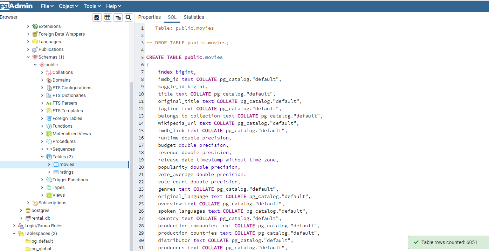
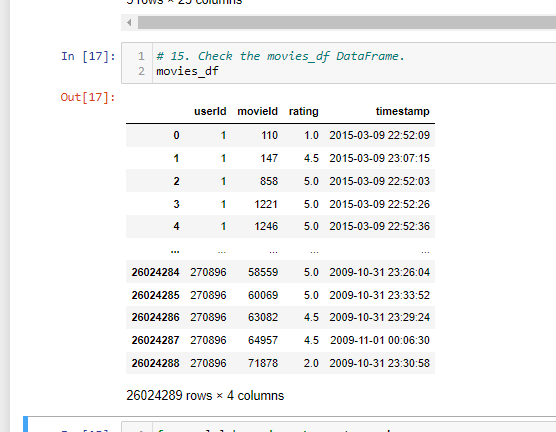

# Movies_ETL
This project required the use of creating the Extract, Transform, Load (ETL) process to create a data pipeline.  There were three large datasets, two .CSV files and one .JSON file that needed to be worked through with Python code to clean, parse, iterate data through.  Following the cleaning, the data was merged together, further cleaned, then stored in a SQL database -- ready for further analysis.  Here were the deliverables for this work:

1 Create the ETL pipeline from raw data
2 Extract data from contrasting data
3 Utilize Pandas to conducting cleaning and transformation
4 Parse the appropriate data
5 Load cleaned data into PostgreSQL tables

The initial review of the movie data was interesting.  Two sources of data were provided.  The first was the .JSON dataset from Wikipedia.  Since the dataset here can be uploaded by quite a number of different contributors a lot of different cleansing techniques were utilized to compare each of the values that were found.  For example, when you look at the 'budget' column for each movie, there are many different monetary values from different countries, i.e; '€', '$', '£', 'HKD', etc.  The amounts were also given in different increments, $x,xxx,xxx vs $x million vs xbillion vs £MIL.  To equally compare each of those values, they needed to be converted.  Similarly, with some of the other columns, 'Producer' and 'Produced By' needed to be merged as well as 'Directed' and 'Directed by'.  Cleaning this data took the majority of the time alloted, and this is the case for many, depending on how 'dirty' the data is or how much cleaning is required when the datasets are given.  The remaining .JSON file needed to be converted to a Pandas data frame so that it could be displayed, merged and compared to the other two data files.

On the otherhand, when looking at the Kaggle movie data-downloaded from the IMDb website, there were standard entries in many of the columns, so that was a bit easier to clean.  This was one of the .CSV files.  Some of the transformations there included, removing a few entries that had corrupted data and converting the 'release_date' to a standard date/time format.

Upon the completion of clensing of these two files, it was evident that a few of the columns were quite similar in nature and the decision was to resolve each matching pair by taking a deeper dive into the values provided in those columns.  In one example, titles of movies were listed as both 'title_wiki' and 'title_kaggle'.  Since the data looked more consistent with the 'title_kaggle' column, the decision was to retain it and drop the 'title_wiki' column.  Another example was the Wikipedia 'box_office' vs the Kaggle 'revenue' columns.  Again the Kaggle data was more consistent, so the decision was to keep the Kaggle information, but to fill-in the zeros with Wikipedia information.  This is all a normal part of the ETL process.

The third file was also a .CSV file and held over 26 million rating counts for each of the movies.  So there was a bit of transformation here in terms of renaming some of the columns and ensuring that each movie held some type of rating value.  Following this work, the merging of dataframes would begin.  Initially the Wikipedia and Kaggle data would be combined first, then the rating data could be merged altogether as a seondary step.

### Figure1

The final deliverable was to create tables within postgreSQL as seen in Figure1 above.  I was able to create the initial database table called 'movies' and the corresponding data was able to populate into the table.  As you can see the table row count is 6051 rows of data.  However there was a FATAL OperationalError which prevented the additional work to update all of the necessary tables into SQL as required.  As soon as the fix has been implemented I will be able to provide an update on the progress to migrate the data.  The final ratings query was created as depicted in Figure2 below, which depicts the over 26 million ratings entries within that dataset.

## Summary
Within this project there were many different ways to clense the datasets.  The trick seems to be to utilize the most appropriate tool, function and/or method to get the desired result.  Although this may be quite a bit of work, it can take some time to do the work and can be frustrating.  Each project provides a new and unique set of requirements, so finding the best most efficient way of transforming the data is the most time-consuming piece.  However, in the end, it's quite rewarding when you see the finished product and can provide solid value to the client.